# VOP–VOIAGE design

## System context

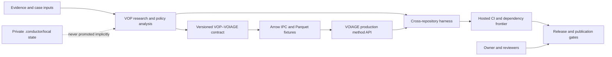

VOP owns the canonical compatibility policy. VOIAGE pins a byte-identical
mirror with an upstream commit and digest. Both producers embed contract,
schema, method, producer, and interchange metadata in Arrow outputs.

## Conductor and GitHub control plane

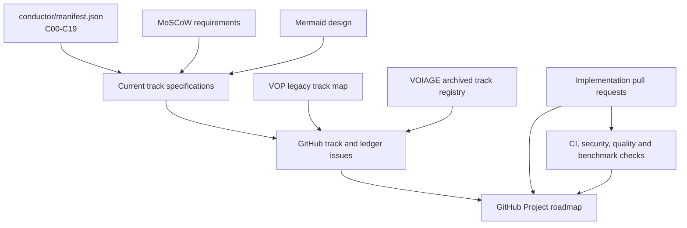

Current track issues use a hidden `vop-voiage-conductor-track-id` marker for
idempotent synchronization. Historical ledgers are closed issues with stable
markers and exhaustive track lists. Local files remain the detailed source of
truth; the GitHub Project is the coordination and audit view.

## Interchange sequence

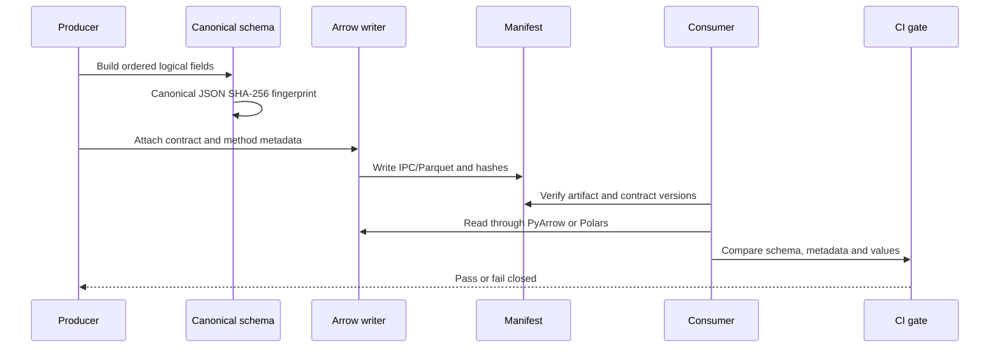

## VOP assurance and maintenance v1.3.0

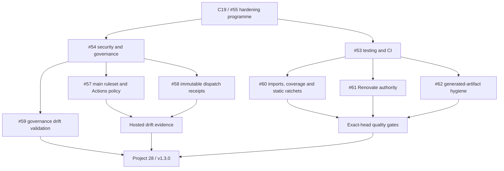

## Safety boundaries

- Cross-repository integration is data/contract based, never an implicit
  source import.
- Experimental backends are opt-in and must preserve numerical parity.
- Private files, credentials, unpublished evidence, and owner decisions remain
  outside public issue bodies and promoted artifacts.
- Publication and registry state are independent from implementation state.

## Engineering harness

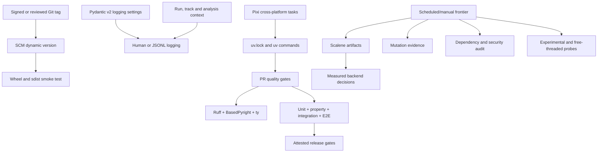

The package metadata and runtime `__version__` resolve from Git through the
build backend. Pixi is a cross-platform task surface and delegates Python
resolution to the same uv lock, preventing two divergent dependency truths.
Expensive or ecosystem-sensitive experiments are explicit evidence lanes and
cannot silently redefine the stable runtime contract.

## Specialized VOI v1.2.0

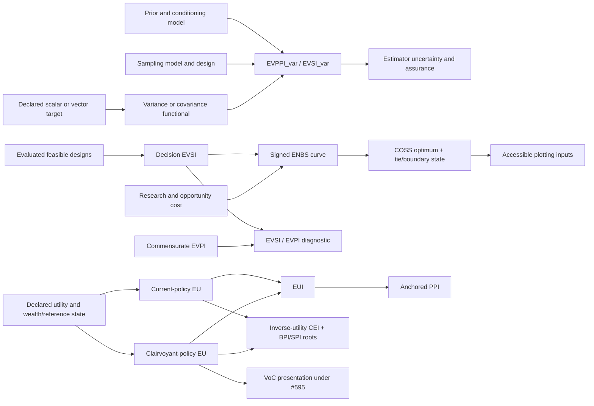

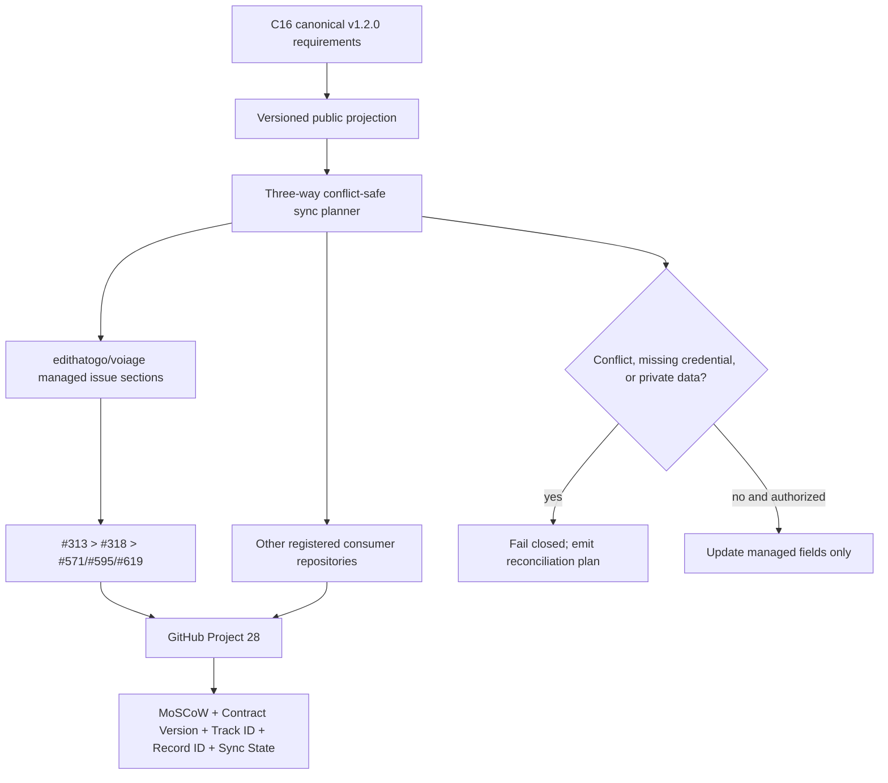

## Specialized VOI v1.3.0 additive MCDA continuation

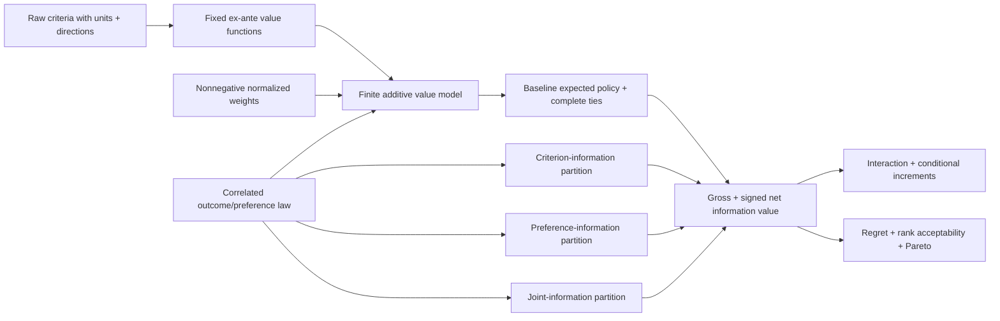

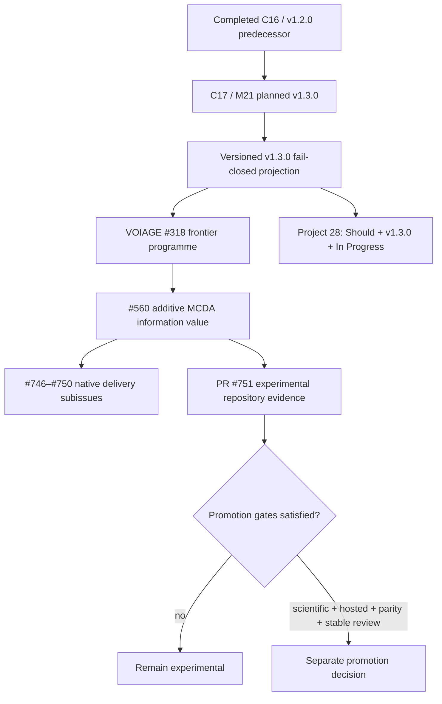

## Typed domain and governance model

## Specialized VOI v1.3.0 residual frontier

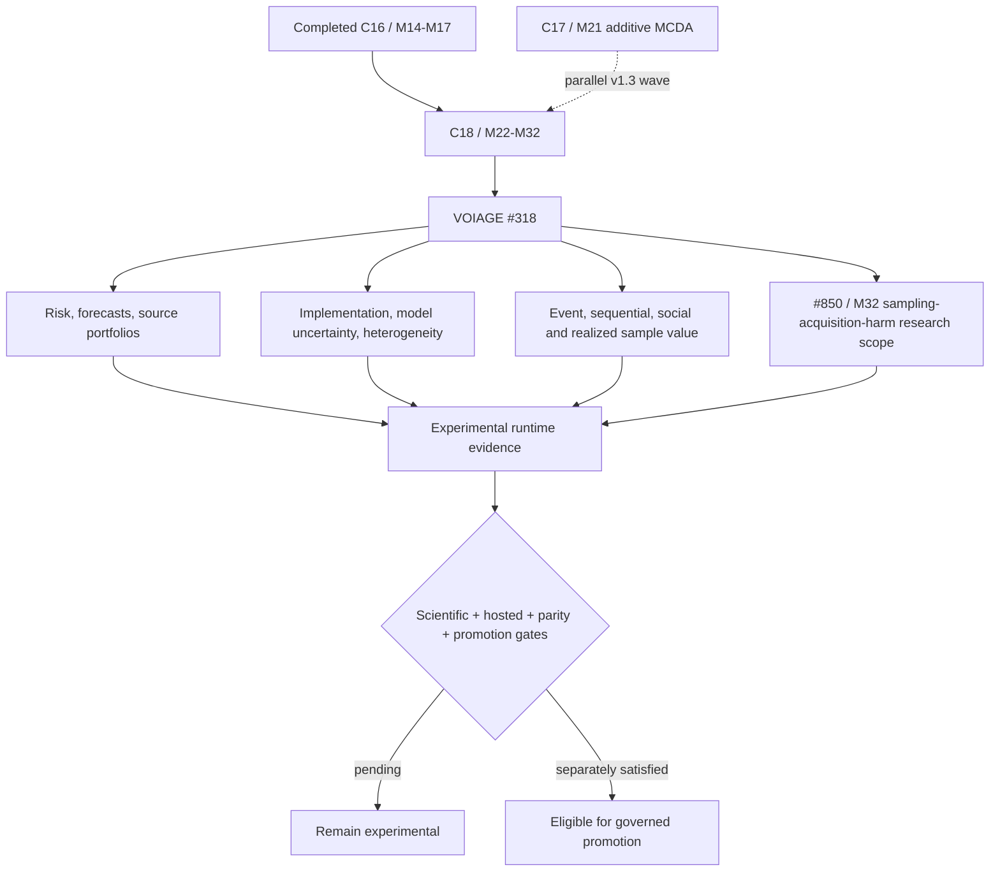

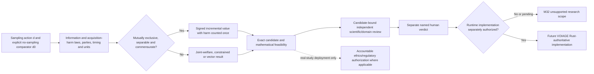

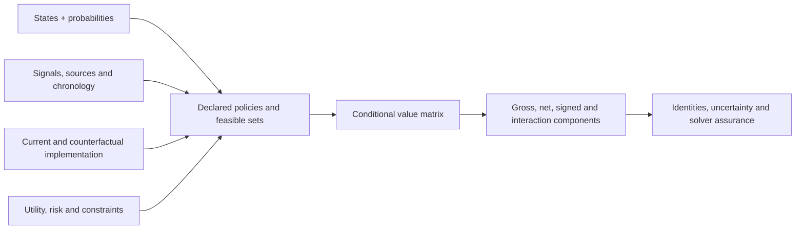

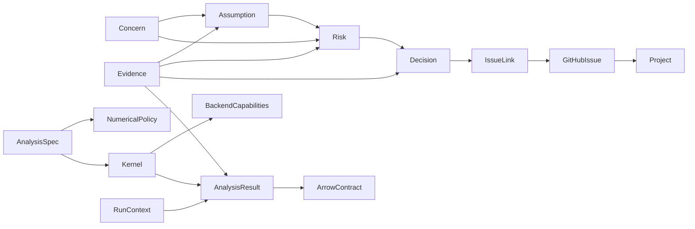

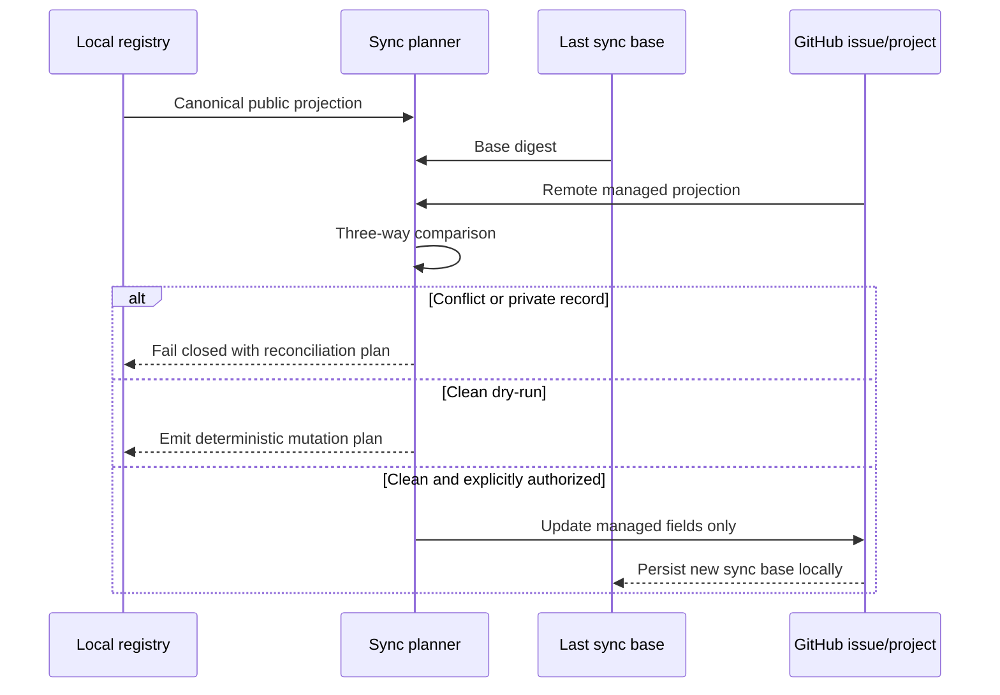
