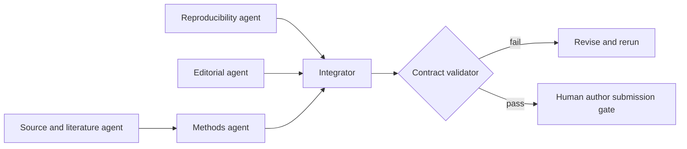

# Paper-update workflow

The workflow is fail-closed. It requires the exact VOP release revision,
Sourceright and Authentext tool receipts, claim/evidence mappings, generated
PDF/source hashes, and a human author decision before any external submission.
