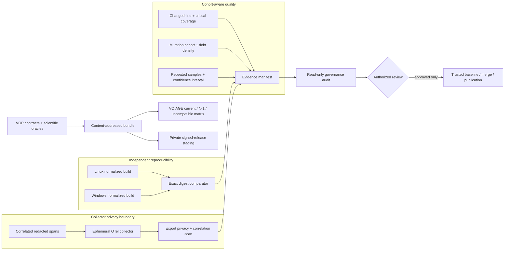

# C15 design: Operational Assurance Excellence

## Invariants

1. Cohort identity is derived from source and configuration digests, never labels.
2. Coverage and performance comparisons are fail-closed on missing or malformed
   evidence.
3. Cross-runner comparison normalizes timestamps and platform-specific archive
   metadata before comparing the intended publishable bytes.
4. The collector receives already-redacted telemetry; post-export scanning is a
   second independent privacy control.
5. Approval-bearing operations are staged but not executed by pull-request CI.
