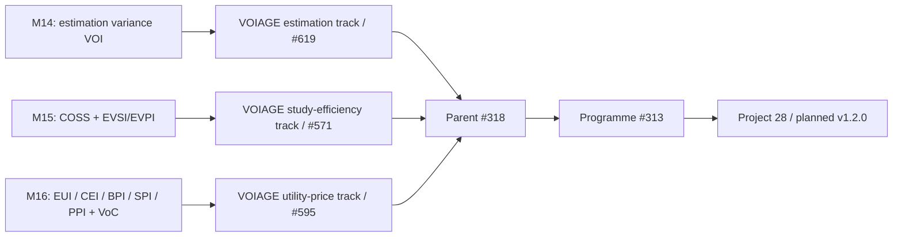
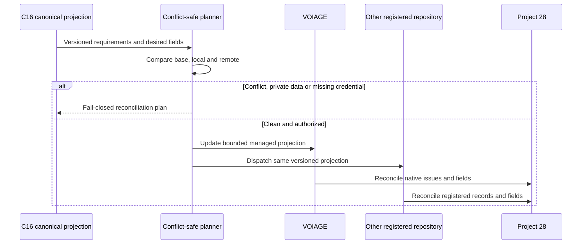

# C16 design — planned v1.2.0

```mermaid
flowchart LR
    M14["M14: estimation variance VOI"] --> E["VOIAGE estimation track / #619"]
    M15["M15: COSS + EVSI/EVPI"] --> S["VOIAGE study-efficiency track / #571"]
    M16["M16: EUI / CEI / BPI / SPI / PPI + VoC"] --> U["VOIAGE utility-price track / #595"]
    E --> P["Parent #318"]
    S --> P
    U --> P
    P --> Root["Programme #313"]
    Root --> Project["Project 28 / planned v1.2.0"]
```

```mermaid
sequenceDiagram
    participant C as C16 canonical projection
    participant P as Conflict-safe planner
    participant V as VOIAGE
    participant R as Other registered repository
    participant G as Project 28
    C->>P: Versioned requirements and desired fields
    P->>P: Compare base, local and remote
    alt Conflict, private data or missing credential
        P-->>C: Fail-closed reconciliation plan
    else Clean and authorized
        P->>V: Update bounded managed projection
        P->>R: Dispatch same versioned projection
        V->>G: Reconcile native issues and fields
        R->>G: Reconcile registered records and fields
    end
```
