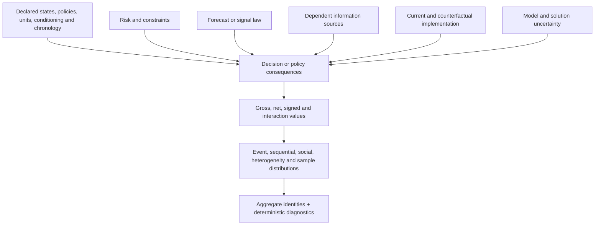
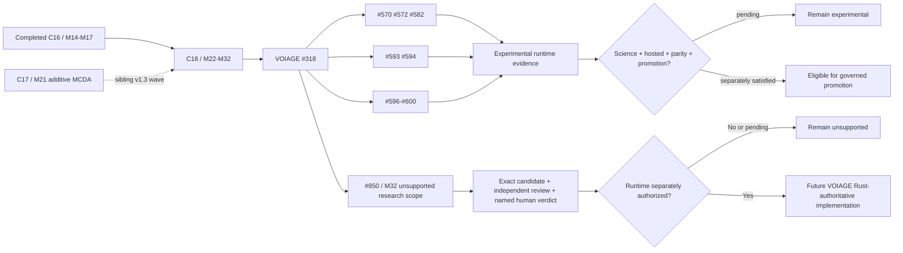
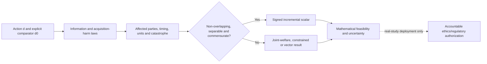

# C18 design — planned v1.3.0 residual frontier

```mermaid
flowchart TD
    Inputs["Declared states, policies, units, conditioning and chronology"] --> Decision["Decision or policy consequences"]
    Risk["Risk and constraints"] --> Decision
    Forecast["Forecast or signal law"] --> Decision
    Sources["Dependent information sources"] --> Decision
    Implementation["Current and counterfactual implementation"] --> Decision
    Model["Model and solution uncertainty"] --> Decision
    Decision --> Values["Gross, net, signed and interaction values"]
    Values --> Local["Event, sequential, social, heterogeneity and sample distributions"]
    Local --> Reconcile["Aggregate identities + deterministic diagnostics"]
```

```mermaid
flowchart LR
    C16["Completed C16 / M14-M17"] --> C18["C18 / M22-M32"]
    C17["C17 / M21 additive MCDA"] -. "sibling v1.3 wave" .-> C18
    C18 --> Parent["VOIAGE #318"]
    Parent --> Wave1["#570 #572 #582"]
    Parent --> Wave2["#593 #594"]
    Parent --> Wave3["#596-#600"]
    Parent --> HarmScope["#850 / M32 unsupported research scope"]
    Wave1 --> Evidence["Experimental runtime evidence"]
    Wave2 --> Evidence
    Wave3 --> Evidence
    HarmScope --> HarmReview["Exact candidate + independent review + named human verdict"]
    HarmReview --> HarmRuntime{"Runtime separately authorized?"}
    HarmRuntime -->|"No or pending"| HarmUnsupported["Remain unsupported"]
    HarmRuntime -->|"Yes"| HarmFuture["Future VOIAGE Rust-authoritative implementation"]
    Evidence --> Gates{"Science + hosted + parity + promotion?"}
    Gates -->|"pending"| Experimental["Remain experimental"]
    Gates -->|"separately satisfied"| Eligible["Eligible for governed promotion"]
```

```mermaid
flowchart LR
    Design["Action d and explicit comparator d0"] --> Joint["Information and acquisition-harm laws"]
    Joint --> Parties["Affected parties, timing, units and catastrophe"]
    Parties --> ScalarGate{"Non-overlapping, separable and commensurate?"}
    ScalarGate -->|"Yes"| Scalar["Signed incremental scalar"]
    ScalarGate -->|"No"| NonScalar["Joint-welfare, constrained or vector result"]
    Scalar --> Candidate["Mathematical feasibility and uncertainty"]
    NonScalar --> Candidate
    Candidate -. "real-study deployment only" .-> Ethics["Accountable ethics/regulatory authorization"]
```
