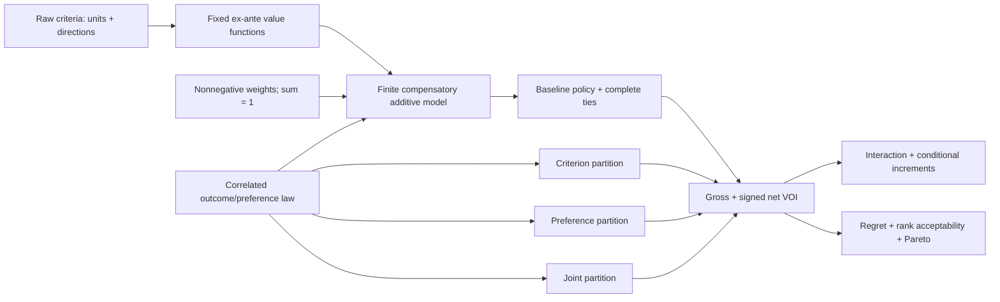
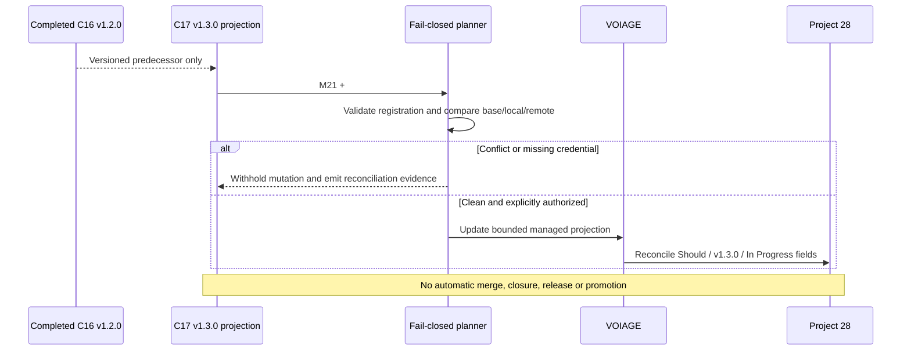
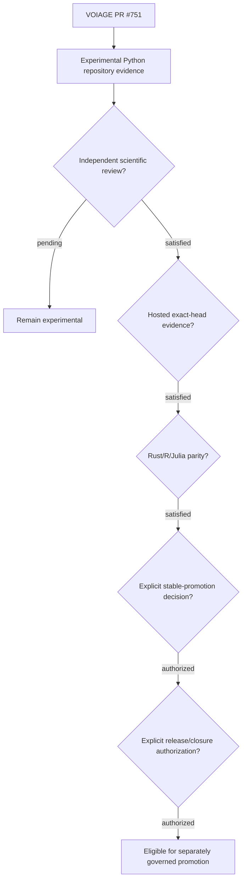

# C17 design — planned v1.3.0

```mermaid
flowchart LR
    Inputs["Raw criteria: units + directions"] --> Fixed["Fixed ex-ante value functions"]
    Fixed --> Model["Finite compensatory additive model"]
    Weights["Nonnegative weights; sum = 1"] --> Model
    Law["Correlated outcome/preference law"] --> Model
    Model --> Base["Baseline policy + complete ties"]
    Law --> C["Criterion partition"]
    Law --> P["Preference partition"]
    Law --> J["Joint partition"]
    Base --> VOI["Gross + signed net VOI"]
    C --> VOI
    P --> VOI
    J --> VOI
    VOI --> I["Interaction + conditional increments"]
    VOI --> D["Regret + rank acceptability + Pareto"]
```

```mermaid
sequenceDiagram
    participant C16 as Completed C16 v1.2.0
    participant C17 as C17 v1.3.0 projection
    participant P as Fail-closed planner
    participant V as VOIAGE
    participant G as Project 28
    C16-->>C17: Versioned predecessor only
    C17->>P: M21 + #318/#560/#746-#750 + PR #751
    P->>P: Validate registration and compare base/local/remote
    alt Conflict or missing credential
        P-->>C17: Withhold mutation and emit reconciliation evidence
    else Clean and explicitly authorized
        P->>V: Update bounded managed projection
        V->>G: Reconcile Should / v1.3.0 / In Progress fields
    end
    Note over C17,G: No automatic merge, closure, release or promotion
```

```mermaid
flowchart TD
    PR["VOIAGE PR #751"] --> Experimental["Experimental Python repository evidence"]
    Experimental --> Scientific{"Independent scientific review?"}
    Scientific -->|"pending"| Hold["Remain experimental"]
    Scientific -->|"satisfied"| Hosted{"Hosted exact-head evidence?"}
    Hosted -->|"satisfied"| Parity{"Rust/R/Julia parity?"}
    Parity -->|"satisfied"| Stable{"Explicit stable-promotion decision?"}
    Stable -->|"authorized"| Release{"Explicit release/closure authorization?"}
    Release -->|"authorized"| Eligible["Eligible for separately governed promotion"]
```
