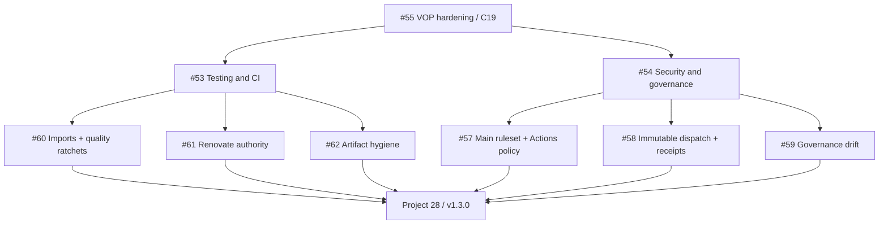
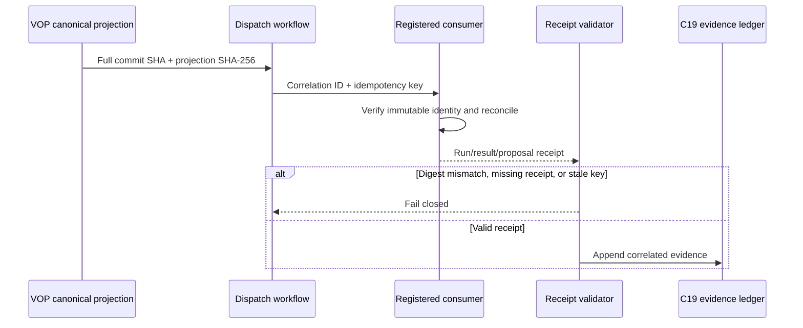
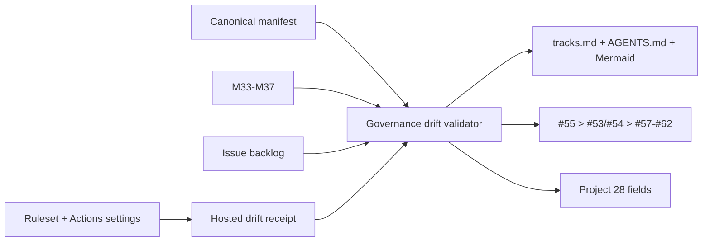

# C19 design — planned v1.3.0

```mermaid
flowchart TD
    Root["#55 VOP hardening / C19"]
    CI["#53 Testing and CI"]
    Gov["#54 Security and governance"]
    Root --> CI
    Root --> Gov
    CI --> Imports["#60 Imports + quality ratchets"]
    CI --> Renovate["#61 Renovate authority"]
    CI --> Artifacts["#62 Artifact hygiene"]
    Gov --> Rules["#57 Main ruleset + Actions policy"]
    Gov --> Sync["#58 Immutable dispatch + receipts"]
    Gov --> Drift["#59 Governance drift"]
    Imports --> Project["Project 28 / v1.3.0"]
    Renovate --> Project
    Artifacts --> Project
    Rules --> Project
    Sync --> Project
    Drift --> Project
```

```mermaid
sequenceDiagram
    participant V as VOP canonical projection
    participant D as Dispatch workflow
    participant C as Registered consumer
    participant R as Receipt validator
    participant E as C19 evidence ledger
    V->>D: Full commit SHA + projection SHA-256
    D->>C: Correlation ID + idempotency key
    C->>C: Verify immutable identity and reconcile
    C-->>R: Run/result/proposal receipt
    alt Digest mismatch, missing receipt, or stale key
        R-->>D: Fail closed
    else Valid receipt
        R->>E: Append correlated evidence
    end
```

```mermaid
flowchart LR
    Manifest["Canonical manifest"] --> Validator["Governance drift validator"]
    Requirements["M33-M37"] --> Validator
    Backlog["Issue backlog"] --> Validator
    Hosted["Ruleset + Actions settings"] --> Receipt["Hosted drift receipt"]
    Receipt --> Validator
    Validator --> Registry["tracks.md + AGENTS.md + Mermaid"]
    Validator --> Issues["#55 > #53/#54 > #57-#62"]
    Validator --> Project["Project 28 fields"]
```
